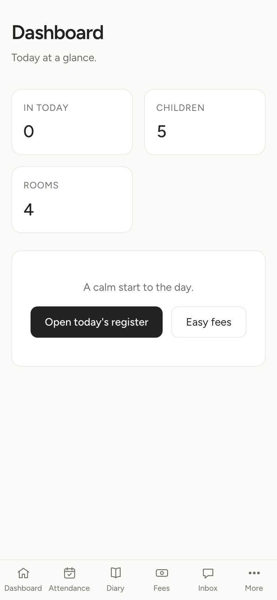
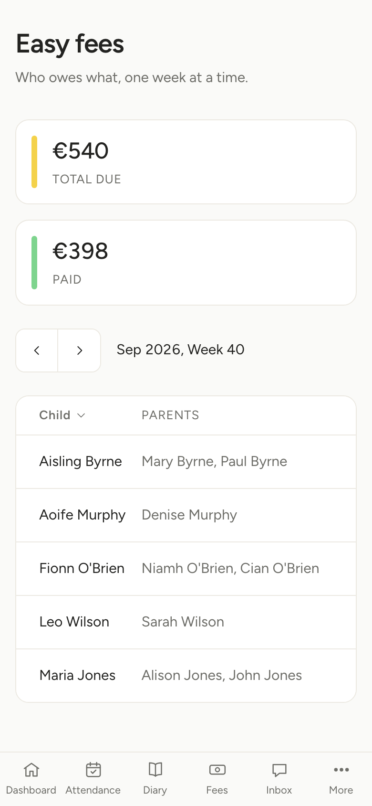
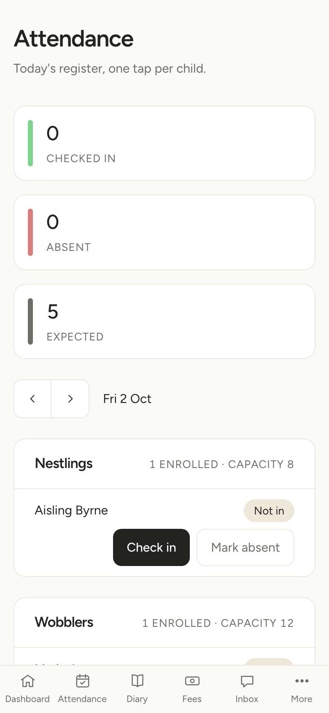
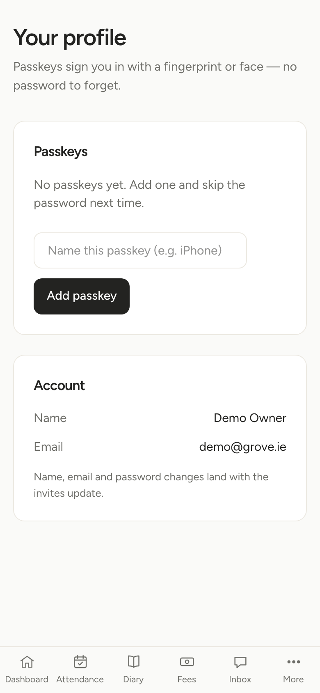

# Grove: creche management platform (demo)

> [!IMPORTANT]
> Proof of concept. Technical demo of a multi-tenant childcare management platform on Spring Boot 4 and Java 25, built for evaluation. Not production-ready without real infrastructure.

Grove keeps a multi-tenant SaaS app deliberately simple: server-side rendering with Thymeleaf + htmx, Spring Security 7 with WebAuthn passkeys and magic links, and Java 25 virtual threads.

| Dashboard | Easy fees |
| :---: | :---: |
| <a href="docs/screenshots/dashboard.png"></a> | <a href="docs/screenshots/fees.png"></a> |
| **Attendance** | **Profile & passkeys** |
| <a href="docs/screenshots/attendance.png"></a> | <a href="docs/screenshots/profile.png"></a> |

## Stack

- Java 25 LTS, virtual threads enabled (`spring.threads.virtual.enabled: true`)
- Spring Boot 4.1.x: Spring Security 7, Spring Data JPA, Flyway migrations
- Gradle 9.8 (Kotlin DSL), GraalVM native build tools (`nativeCompile`)
- SQLite with WAL (`PRAGMA journal_mode=WAL`, `busy_timeout=5000`) and tuned HikariCP pooling
- Auth: form login (BCrypt, min 12 chars), single-use hashed magic links, WebAuthn/FIDO2 passkeys
- Server-driven UI: Thymeleaf, htmx fragment swaps, Alpine.js, Tailwind CSS
- Multi-tenancy: Hibernate `@TenantId` on every business table (`creche_id`)
- CI: tests on Java 25, dependency freshness checks, CodeQL, Trivy scanning, Dependabot

## Prerequisites

- Java 25 (Temurin or similar), with `JAVA_HOME` set:
  ```bash
  export JAVA_HOME=/path/to/openjdk-25
  export PATH="$JAVA_HOME/bin:$PATH"
  ```

## Build & test

```bash
# 34 unit & integration tests (AOT test processing included)
./gradlew test

# Check dependencies for updates
./gradlew dependencyUpdates

# GraalVM native binary (optional, needs GraalVM with native-image)
./gradlew nativeCompile
```

## Run

```bash
./gradlew bootRun
```

App starts on `http://localhost:8080`. First startup runs Flyway, which creates and seeds the demo database (`grove.db`) in the repo root.

## Deploy demo (nginx + PostgreSQL)

`docker-compose.yml` sketches a production-shaped deploy: nginx in front of the containerised app, PostgreSQL behind it.

```bash
docker compose up --build
```

Open `http://localhost:8080` (nginx; the app container is not exposed directly). Same demo credentials, fresh database seeded by Flyway in Postgres. Magic links print to the app container: `docker compose logs -f app`.

| Service | Image | Role |
| :--- | :--- | :--- |
| `nginx` | `nginx:1.29-alpine` | Reverse proxy on `:80` (TLS termination point in a real deploy), 10 MB upload limit, `X-Forwarded-*` headers |
| `app` | built from `Dockerfile` | Multi-stage Gradle 9 / JDK 25 build, layered boot jar on `eclipse-temurin:25-jre`, non-root user, `prod` profile |
| `db` | `postgres:17-alpine` | PostgreSQL with a named volume; schema applied by Flyway (PG18 is rejected by the BOM-managed Flyway 12.4, noted on the compose service) |

- The `prod` profile (`application-prod.yml`) applies the same schema through a parallel Postgres migration set (`db/migration-postgres`). Local dev stays on SQLite, the documented spec deviation; Postgres is what a real deployment would use.
- `server.forward-headers-strategy: framework` makes the app honor the host/scheme headers nginx sets, so redirects and magic links carry the public URL.
- Keep the data: `docker compose down`. Include the volume: `docker compose down -v`.

## Demo logins

Pre-seeded creche: **Grove Family Creche**.

### Owner/manager account

`http://localhost:8080/login` with `demo@grove.ie` / `grove`.

### Magic link (passwordless)

Visit `http://localhost:8080/login/link` and enter `demo@grove.ie`. Dev mode logs the link to the terminal instead of emailing it:

```
INFO ... DevMagicLinkSender : Magic link for demo@grove.ie (dev only, not emailed): http://localhost:8080/login/ott?token=...
```

Click the URL to log in.

### Passkeys

Log in, go to `http://localhost:8080/profile`, click **Register Passkey** (Touch ID, Face ID, Windows Hello, YubiKey).

### New creche

Sign up at `http://localhost:8080/signup`.

## Screens

- `/admin`: classrooms, enrolment, attendance overview
- `/admin/attendance`: check-in / check-out register
- `/admin/fees`: billing, ECCE/NCS subventions, family invoices
- `/admin/profile`: account details and passkey registration

## License

Apache License 2.0.
