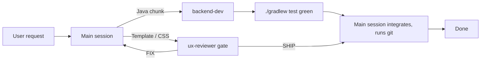

# Agent topology

Work in this repo is orchestrated with Claude Code subagents. Definitions live in `.claude/agents/` — Claude Code's required location, which is why there is no top-level `agents/` directory.

## Main session (orchestrator)

Routes each request, owns UX/template/CSS work directly, spawns subagents via the Agent tool, integrates their reports, runs git.

## backend-dev

`.claude/agents/backend-dev.md` — Sonnet model, tools Read/Write/Edit/Bash/Grep/Glob. All Java work: entities, repositories, services, security config, Flyway migrations, tests. One coherent chunk per spawn; every spawn ends `./gradlew test` green and reports files changed, migration numbers, and test counts.

## ux-reviewer

`.claude/agents/ux-reviewer.md` — read-only (Read/Grep/Glob). Design gate: every template/fragment/CSS change is reviewed against `docs/design.md` tokens and rules before it counts as done. Verdict per file `PASS` or findings; ends `VERDICT: SHIP` or `VERDICT: FIX`.

## Flow

## Adding an agent

Drop a new `.md` in `.claude/agents/` with frontmatter (`name`, `description`, `tools`, `model`), then update the list and diagram above.
